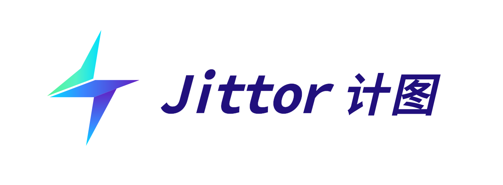
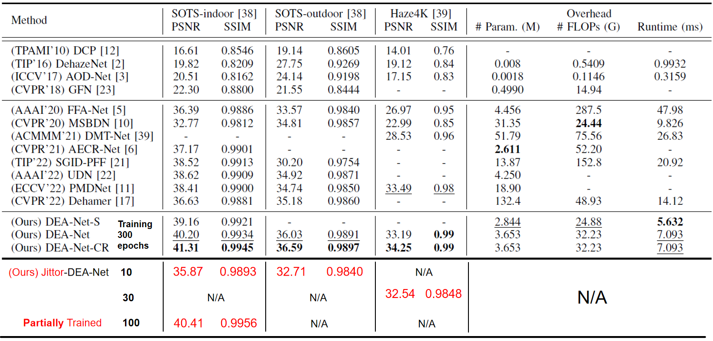
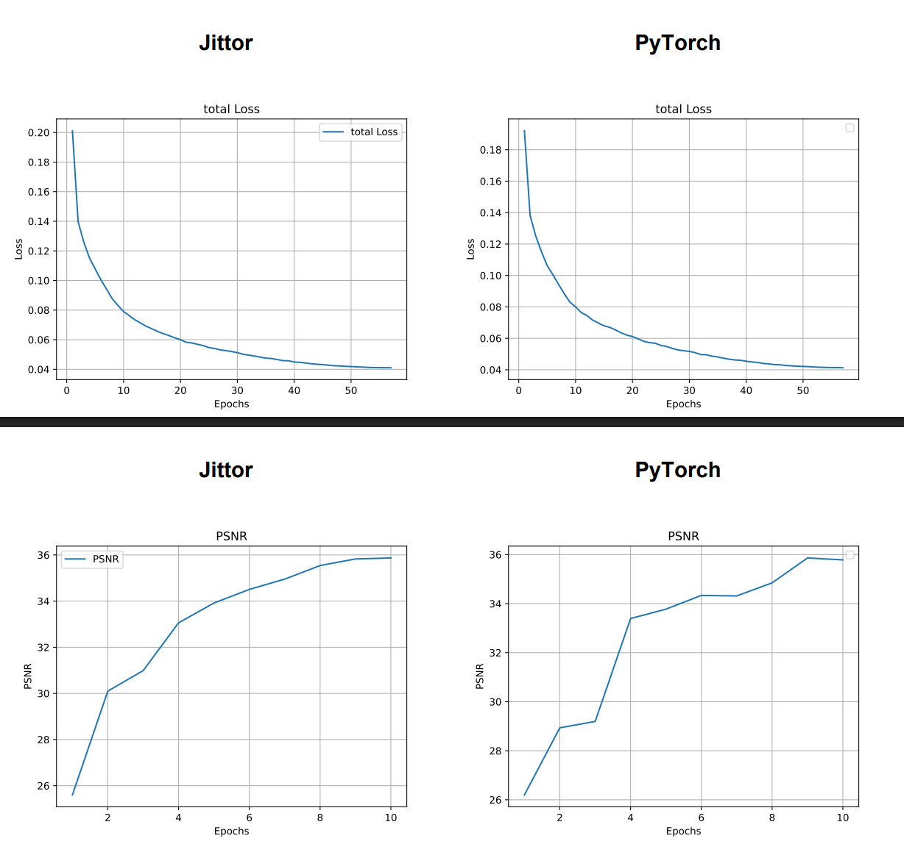

<div align="center">




# Jittor-DEA-Net

**DEA-Net: Single image dehazing based on detail-enhanced convolution and content-guided attention (IEEE TIP 2024)**

[](https://cg.cs.tsinghua.edu.cn/jittor/)
[](LICENSE)
[](https://github.com/ZR-1N/Jittor-DEA-Net)

[](https://arxiv.org/abs/2301.04805)
[](https://github.com/cecret3350/DEA-Net)

[English](#-introduction) | [简体中文](#-项目简介)

</div>

---

## 📖 Introduction (项目简介)

This repository is an unofficial implementation of **DEA-Net** based on the [Jittor (计图)](https://cg.cs.tsinghua.edu.cn/jittor/) deep learning framework. This project is part of the **"Sprouts Program" at Nankai University**.

本项目是 IEEE TIP 2024 论文 **DEA-Net** 的**非官方 Jittor (计图)** 版本复现，属于 **南开大学“新芽计划”** 学习成果。

DEA-Net proposes a novel detail-enhanced convolution (DEConv) and content-guided attention (CGA) mechanism to effectively restore haze-free images. By leveraging Jittor's **Just-In-Time (JIT) compilation** and **operator fusion**, this implementation achieves competitive training efficiency compared to the PyTorch version while maintaining algorithmic performance.

DEA-Net 提出了一种细节增强卷积（DEConv）和内容引导注意力（CGA）机制，能够有效恢复去雾图像。得益于 Jittor 框架的 **即时编译 (JIT)** 和 **算子融合** 技术，本项目在保持原论文精度的同时，实现了高效的训练与推理。

This implementation has been shared with the official repository for reproducibility and community reference.

### Overall Architecture
<div align="center">
  
</div>

### Results



---
**Training Log**：Taking the ITS dataset as an example, the changes in the Loss and PSNR curves after 10 epochs of training are shown in the figure (Jittor is aligned with Pytorch).

**训练日志**：以ITS数据集为例，其训练10个epoch的Loss与PSNR曲线变化如图（Jittor与Pytorch对齐）



## 📰 News

- **[2025-12-21]** 🚀 Initial release of Jittor-DEA-Net code and pre-trained weights for HAZE4K, ITS, and OTS datasets.
- **[2025-11-17]** 🏗️ Project initialized under Nankai University "Sprouts Program".

---

## 📊 Model Zoo & Results Comparisons (模型库与结果对比)

We have provided a comparison among the Jittor implementation, the PyTorch implementation (partially trained), and the official PyTorch implementation (fully convergent training).

我们提供了 Jittor 实现、Pytorch 实现（部分训练）和官方 PyTorch 实现（完全收敛训练）之间的比较。

**Note:**
* **RESIDE-ITS:** We provide two versions. The **10-epoch** version allows for a direct comparison with the PyTorch implementation at the same stage. The 100-epoch version achieves a comparable SSIM to the official 300-epoch model, which may indicate the efficiency of the implementation.
* **Other Datasets:** The weights for HAZE4K and RESIDE-OTS are currently from the initial training phase (e.g., 10-30 epochs) but already demonstrate competitive performance.

**注意：**
* **RESIDE-ITS:** 我们提供了两个版本。**10 Epoch** 版本用于与同阶段的 PyTorch 实现进行直接对比。100 epoch版本实现了与官方300 epoch模型相当的SSIM，这证明了我们复现的精度。
* **其他数据集:** HAZE4K 和 RESIDE-OTS 的权重目前仍处于训练初期（约 10-30 Epoch），但已展现出优秀的性能。

| Dataset | Framework | Epochs Trained | PSNR (dB) | SSIM | Download Link |
| :--- | :--- | :---: | :---: | :---: | :---: |
| **HAZE4K** | **Jittor (Ours)** | **30** (Partial) | 32.54 | 0.9848 | [Google Drive (Ours)](https://drive.google.com/drive/folders/1MN1alc4gBzk90Vc8V1AXivwx2FwrF5f3?usp=sharing) |
| | PyTorch (Ours) | 10 | 31.17 | 0.9813 | [Google Drive (Ours)](https://drive.google.com/drive/folders/1QI3yJEXezM30hhdjgW_DZbaIspwCGhIO?usp=sharing) |
| | PyTorch (Official) | 300 | 34.26 | 0.9985 | [Google Drive](https://drive.google.com/drive/folders/1Rjb8dpyNnvvr0XLvIX9fg8Hdru_MhMCj?usp=sharing) / [Baidu (pwd:dcyb)](https://pan.baidu.com/s/1retfKIs_Om-D4zA45sL6Kg?pwd=dcyb) |
| **RESIDE-ITS** | **Jittor (Ours)** | **10** (Partial) | 35.87 | 0.9893 | [Google Drive (Ours)](https://drive.google.com/drive/folders/1MN1alc4gBzk90Vc8V1AXivwx2FwrF5f3?usp=sharing) |
| | **Jittor (Ours)** | **100**(Partial) | **40.41** | **0.9956** | [Google Drive (Ours)](https://drive.google.com/drive/folders/1MN1alc4gBzk90Vc8V1AXivwx2FwrF5f3?usp=sharing) |
| | PyTorch (Ours) | 10 | 35.78 | 0.9876 | [Google Drive (Ours)](https://drive.google.com/drive/folders/1QI3yJEXezM30hhdjgW_DZbaIspwCGhIO?usp=sharing) |
| | PyTorch (Official) | 300 | 41.31 | 0.9945 | [Google Drive](https://drive.google.com/drive/folders/1Rjb8dpyNnvvr0XLvIX9fg8Hdru_MhMCj?usp=sharing) / [Baidu (pwd:dcyb)](https://pan.baidu.com/s/1retfKIs_Om-D4zA45sL6Kg?pwd=dcyb) |
| **RESIDE-OTS** | **Jittor (Ours)** | **10** (Partial) | 32.71 | 0.9840 | [Google Drive (Ours)](https://drive.google.com/drive/folders/1MN1alc4gBzk90Vc8V1AXivwx2FwrF5f3?usp=sharing) |
| | PyTorch (Official) | 300 | 36.59 | 0.9897 | [Google Drive](https://drive.google.com/drive/folders/1Rjb8dpyNnvvr0XLvIX9fg8Hdru_MhMCj?usp=sharing) / [Baidu (pwd:dcyb)](https://pan.baidu.com/s/1retfKIs_Om-D4zA45sL6Kg?pwd=dcyb) |

## Visual Results

**Figure 1.** perceptual comparison on outdoor scenes.

From top to bottom: input hazy image, official DEA-Net(HAZE4K 300 epochs) and our Jittor-DEA-Net(HAZE4K 30 epochs)

从上往下分别为输入、使用作者预训练300个 epoch 的HAZE4K数据集模型推理结果，以及使用Jittor部分训练的模型推理结果（使用HAZE4K数据集训练30个epoch的模型）。
> 

**Figure 2.** perceptual comparison on indoor scenes.

From top to bottom: input hazy image, official DEA-Net(ITS 300 epochs), our Jittor-DEA-Net(ITS 10 epochs) and our Jittor-DEA-Net(ITS 100 epochs)

从上往下分别为输入、使用作者预训练300个 epoch 的ITS数据集模型推理结果，以及使用Jittor部分训练的模型推理结果（分别训练了10个epoch和100个epoch的ITS数据集模型）。
> 

**Note:**  
The images shown here are real-world photographs with arbitrary resolutions and are not included in the training dataset. Due to the distribution gap between synthetic training data and real-world scenes, the dehazing performance may not be optimal in some cases. These results are provided for qualitative evaluation of the model’s dehazing capability and generalization ability in real-world scenarios.

The image results, from top to bottom, are the input, the inference results using the model pre-trained by the author for 300 epochs, and the inference results of part of the model trained with Jittor (Figure 1 uses the HAZE4K_30epochs model and Figure 2 uses the ITS_10epochs model and the ITS_100epochs model respectively). As shown in the figure, our trained model can definitely achieve the dehazing effect, but due to the limited number of training iterations and the use of a synthetic dataset, domain shift still causes artifacts that are visible to the naked eye. As the number of training epochs increases, the dehazing effect enhances and artifacts decrease accordingly (refer to Figure 2).

**注意：**  
此处展示的图像均为在真实场景下采集的、尺寸不受限制的自然图像，均未包含在训练数据集中。由于存在数据分布差异，模型在部分区域的去雾效果可能不够理想。本节结果主要用于定性展示模型在真实场景下的去雾能力及其泛化性能。

图片结果从上往下分别为输入、使用作者预训练300个 epoch 的模型推理结果，以及使用 Jittor 训练的部分模型推理结果(图一使用HAZE4K_30epochs模型，图二分别使用ITS_10epochs模型与ITS_100epochs模型)。如图所示，我们训练的模型可以起到一定的去雾效果，但由于训练次数有限且使用的是合成数据集，域偏移仍会导致肉眼可见的伪影，随着训练epoch数的增加，去雾效果增强，伪影也随之减少（可参考图二）。

---

## ⚙️ Installation (安装指南)

### Prerequisites
- Linux (Ubuntu 20.04+ recommended)
- Python 3.8+
- NVIDIA GPU + CUDA

### Setup
1. **Clone the repository:**
    ```bash
    git clone [https://github.com/ZR-1N/Jittor-DEA-Net.git](https://github.com/ZR-1N/Jittor-DEA-Net.git)
    cd Jittor-DEA-Net
    ```
2. **Create env:**
    ```bash
    conda create -n jittor_env python=3.8 -y
    conda activate jittor_env
    ```
3. **Install dependencies:**
    ```bash
    pip install -r requirements.txt
    ```
    *Key dependencies: `jittor`, `numpy`, `Pillow`, `matplotlib`, `tqdm`.*

---

## 📂 Data Preparation (数据准备)

Please download the datasets and organize them strictly as follows.

**Note**: Please download RESIDE-Standard version RESIDE dataset.

请下载数据集并严格按照以下目录结构整理（代码将自动识别该结构）。

**注意**：RESIDE数据集请下载RESIDE-Standard版本的。

**Download Links:** [RESIDE (ITS/OTS)](https://sites.google.com/view/reside-dehaze-datasets/reside-v0) | [HAZE4K](https://github.com/liuye123321/DMT-Net)

```text
Jittor-DEA-Net/
├── code/
├── dataset/
│   ├── HAZE4K/
│   │   ├── train/
│   │   │   ├── hazy/   (Contains .png/.jpg images)
│   │   │   └── clear/  (Contains .png/.jpg images)
│   │   └── test/
│   │       ├── hazy/
│   │       └── clear/
│   ├── ITS/
│   │   ├── train/ ... (Same structure as above)
│   │   └── test/  ...
│   └── OTS/
│   │   ├── train/ ... (Same structure as above)
│   │   └── test/  ...
└── ...
```

---

## 🔥 Training (训练)

We provide training scripts for different datasets. The code automatically handles `.png` and `.jpg` matching.

我们提供了针对不同数据集的训练脚本，代码已自动适配 `.png` 和 `.jpg` 的文件名匹配。

### 1. Train on HAZE4K
```bash
cd code
CUDA_VISIBLE_DEVICES=0 nohup python train.py \
  --model_name DEA-Net-CR-HAZE4K \
  --dataset HAZE4K \
  --epochs 300 \
  --bs 4 \
  --w_loss_CR 0.1 \
  > training_haze4k.log 2>&1 &
```

### 2. Train on RESIDE-ITS (Indoor)
```bash
cd code
CUDA_VISIBLE_DEVICES=0 nohup python train.py \
  --model_name DEA-Net-CR-ITS \
  --dataset ITS \
  --epochs 300 \
  --bs 4 \
  --w_loss_CR 0.1 \
  > training_its.log 2>&1 &
```

### 3. Train on RESIDE-OTS (Outdoor)
```bash
cd code
CUDA_VISIBLE_DEVICES=0 nohup python train.py \
  --model_name DEA-Net-CR-OTS \
  --dataset OTS \
  --epochs 10 \
  --bs 4 \
  --w_loss_CR 0.1 \
  > training_ots.log 2>&1 &
```

*Training logs and checkpoints will be saved in `experiment/`.*

---

## 🖼️ Inference (推理)

This project offers two reasoning modes, corresponding respectively to the different states of the model before and after the **structural reparameterization** transformation. Both scripts have built-in automatic Padding logic and support image input of any resolution.

本项目提供两种推理模式，分别对应模型在 **结构重参数化** 转换前后的不同状态。
两种脚本均内置自动 Padding 逻辑，支持任意分辨率的图像输入。

### 1. 模式对比：Raw vs Fused

| 脚本名称 | 适用场景 | 对应模型架构 | 核心逻辑 |
| :--- | :--- | :--- | :--- |
| **`inference_raw.py`** | 验证刚训练完的模型 (未融合) | `DEANet` (训练版架构) | 使用包含 5 路分支的 DEConv 模块  |
| **`inference_fused.py`** | 测试预训练模型或融合后的模型 | `Backbone` (推理版架构) | 使用数学融合后的单路普通卷积  |

**💡 为什么需要两个脚本？**
- **训练阶段 (Raw)**: 
To enhance the feature extraction capability, the model employs a parallel convolution that includes five branches such as central difference and angular difference. At this point, the weight file (such as' best.pk ') contains multiple parameters.
为了增强特征提取能力，模型使用了包含中心差分、角度差分等 5 个分支的并行卷积 。此时的权重文件（如 `best.pk`）包含多路参数。

- **推理阶段 (Fused)**: 
By executing 'reparam.py', we fuse the 5-way weights into 1 way, thereby simplifying the complex 'DEConv' into the ordinary 'nn.Conv2d'.
通过执行 `reparam.py`，我们将 5 路权重融合为 1 路，从而将复杂的 `DEConv` 简化为普通的 `nn.Conv2d` 。

- **匹配规则(Rule)**: 
If you want to directly use your newly trained '.pk 'model, you must use' inference_raw.py '.
If you want to use the original author's 300-epoch pre-trained model ('.pth ') or your own reparameterized model, you must use 'inference_fused.py'
如果你想直接用自己刚训练出的 `.pk` 模型，必须使用 `inference_raw.py` ;
如果你想使用原作者 300 Epoch 的预训练模型（`.pth`）或自己重参数化后的模型，必须使用 `inference_fused.py` 。
---

### 2. 使用教程 (Usage)

#### 🚀 使用自行训练的原始模型 (Raw Mode)
It is applicable to testing the initial training weights that have not yet run 'reparam.py'

适用于测试尚未运行 `reparam.py` 的初始训练权重：
```bash
cd code
python3 inference_raw.py \
  --input_dir ../my_hazy_images \
  --output_dir ../my_results_raw \
  --model_path ../experiment/HAZE4K/DEA-Net-CR-HAZE4K/saved_model/best.pk
```

 #### ⚡ 使用作者预训练或已融合的模型 (Fused Mode)
It is applicable to testing the weights provided by the original author or the 'best_fused.pk' you generated yourself

适用于测试原作者提供的权重，或您自行生成的 `best_fused.pk`：
```bash
cd code
python3 inference_fused.py \
  --input_dir ../my_hazy_images \
  --output_dir ../my_results_fused \
  --model_path ../trained_models/ITS/PSNR4131_SSIM9945.pth
```

### 3.建议 (Recommendation)

A more recommended approach is to re-parameterize the model through reparam.py and then use inference_fused.py for inference. The reason is that after re-parameterization, the five parallel convolution re-parameters are combined into one vanilla convolution, which can significantly accelerate the inference efficiency.

更推荐的方式是通过reparam.py将模型进行重参数化后使用inference_fused.py进行推理，原因在于重参数化后五个并行卷积重参数为一个普通卷积，更够显著加快推理速度。

---

## 🔗 Acknowledgements & Citation (致谢与引用)

This project is based on the official PyTorch implementation of [DEA-Net](https://github.com/cecret3350/DEA-Net). We thank the authors for their excellent work.

If you find this repository useful, please consider citing the original paper:

```bibtex
@article{chen2023dea,
  title={DEA-Net: Single image dehazing based on detail-enhanced convolution and content-guided attention},
  author={Chen, Zixuan and He, Zewei and Lu, Zhe-Ming},
  journal={IEEE Transactions on Image Processing},
  year={2024},
  volume={33},
  pages={1002-1015}
}
```

## 📧 Contact

For any questions regarding this Jittor implementation, please contact:
**Shang Wenxuan (尚文轩)**: shangwenxuan.nku@gmail.com